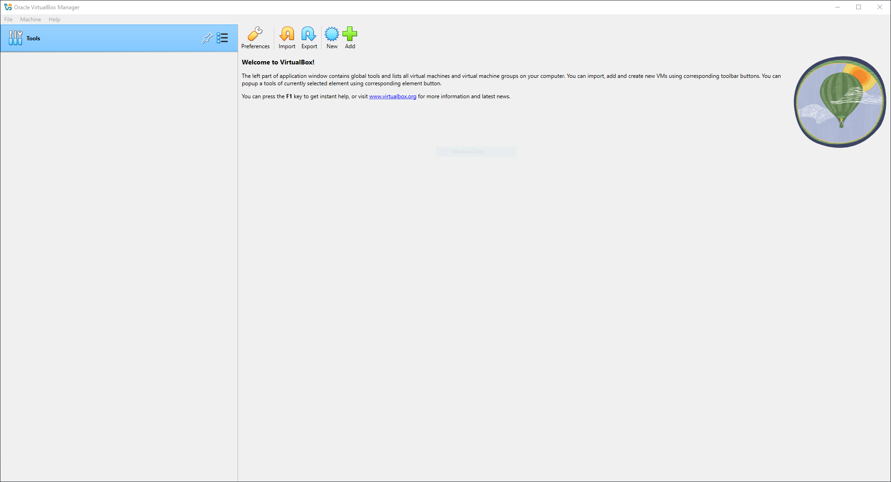

# Task 1. Install and Configure Windows 10/11 Virtual Machine
## Download Virtual Box

## Get Windows 10/11 ISO File
Windows 11 Download: https://www.microsoft.com/en-us/software-download/windows11

## Set up VM
1. Set custom user/password
2. 4 GB Memory
3. 2 Processors
4. Create Virtual Hard Disk with 15 GB of space
<T1_3>
## Windows Set up
1. Click "I Don't Have A Key"
2. Wait for installation to finish
<T1_4>

## Ready To Go
<T1_5>
